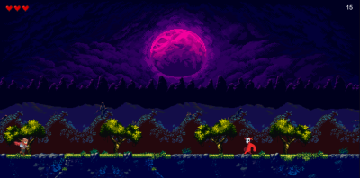
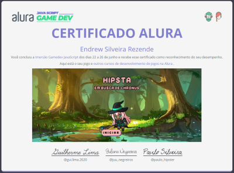

# Jogo 2d Criado na Imersão Game Dev da Alura

## Tecnologias Utilizadas:
- HTML
- CSS
- JavaScript
- Biblioteca P5.js
# Link jogável no p5.js

https://editor.p5js.org/EndrewSilveira/full/lx3pMbozj

# Certificado da Imersão Gamedev JavaScript

## Durante 5 dias foi feito um jogo 2D utilizando:
- HTML
- CSS
- JavaScript
- P5.js

## Funcionalidades adicionadas no jogo:
- [x] Animação de sprites
- [x] Perder vida
- [x] Colidir com inimigos
- [x] Modificar inimigos atuais utilizando mapa .json
- [x] Elementos que aparecem aleatóriamente no cenário
- [x] Apresentação da história
- [x] Botões de controle
- [x] Controle de pulo e gravidade 
